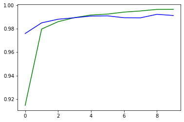
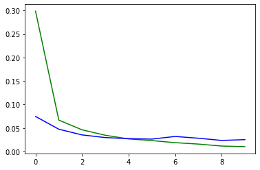

# MNIST-CNN

## Dataset : [keras MNIST](https://www.tensorflow.org/api_docs/python/tf/keras/datasets/mnist/load_data)

## model

```
 Layer (type)                Output Shape              Param #
=================================================================
 zero_padding2d (ZeroPadding  (None, 30, 30, 1)        0
 2D)

 conv2d (Conv2D)             (None, 28, 28, 32)        320

 max_pooling2d (MaxPooling2D  (None, 14, 14, 32)       0
 )

 zero_padding2d_1 (ZeroPaddi  (None, 16, 16, 32)       0
 ng2D)

 conv2d_1 (Conv2D)           (None, 14, 14, 64)        18496

 max_pooling2d_1 (MaxPooling  (None, 7, 7, 64)         0
 2D)

 flatten (Flatten)           (None, 3136)              0

 dense (Dense)               (None, 128)               401536

 dense_1 (Dense)             (None, 10)                1290

=================================================================
Total params: 421,642
Trainable params: 421,642
Non-trainable params: 0
```

## Result 

```
Epoch 1/10
200/200 [==============================] - 58s 288ms/step - loss: 0.3010 - accuracy: 0.9134 - val_loss: 0.0758 - val_accuracy: 0.9758
Epoch 2/10
200/200 [==============================] - 63s 318ms/step - loss: 0.0663 - accuracy: 0.9801 - val_loss: 0.0414 - val_accuracy: 0.9867
Epoch 3/10
200/200 [==============================] - 61s 305ms/step - loss: 0.0445 - accuracy: 0.9866 - val_loss: 0.0336 - val_accuracy: 0.9884
Epoch 4/10
200/200 [==============================] - 62s 312ms/step - loss: 0.0341 - accuracy: 0.9896 - val_loss: 0.0363 - val_accuracy: 0.9879
Epoch 5/10
200/200 [==============================] - 55s 274ms/step - loss: 0.0285 - accuracy: 0.9915 - val_loss: 0.0319 - val_accuracy: 0.9886
Epoch 6/10
200/200 [==============================] - 64s 322ms/step - loss: 0.0225 - accuracy: 0.9930 - val_loss: 0.0280 - val_accuracy: 0.9901
Epoch 7/10
200/200 [==============================] - 55s 277ms/step - loss: 0.0182 - accuracy: 0.9941 - val_loss: 0.0284 - val_accuracy: 0.9911
Epoch 8/10
200/200 [==============================] - 55s 273ms/step - loss: 0.0152 - accuracy: 0.9952 - val_loss: 0.0258 - val_accuracy: 0.9908
Epoch 9/10
200/200 [==============================] - 56s 280ms/step - loss: 0.0122 - accuracy: 0.9960 - val_loss: 0.0301 - val_accuracy: 0.9906
Epoch 10/10
200/200 [==============================] - 69s 346ms/step - loss: 0.0109 - accuracy: 0.9964 - val_loss: 0.0326 - val_accuracy: 0.9898
```

## plot : 




<hr>

